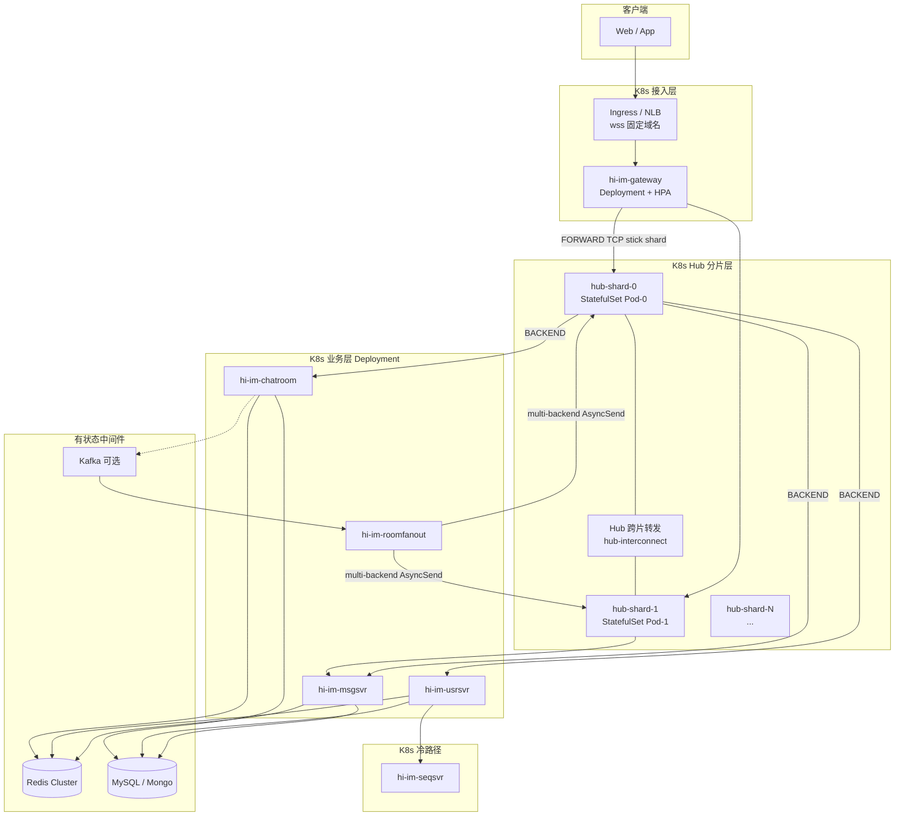

# hi-im 档 C — 多 Hub K8s 集群设计方案

> **定位**：单 Hub 无法支撑百万级同时在线；本文在 [hi-im-档C技术方案设计.md](./hi-im-档C技术方案设计.md) 基础上，给出 **K8s 生产级多 Hub 分片** 与各 **独立服务横向扩缩容** 方案。  
> **版本**：v0.1-draft · 2026-07-05  
> **前置**：[系统问题收集/问题集合1.md](./系统问题收集/问题集合1.md)（单 Hub 队列 MPSC/SPSC 须先正确）  
> **许可证**：[Apache License 2.0](../LICENSE)

---

## 1. 目标与约束

### 1.1 为什么要多 Hub

| 维度 | 单 Hub 瓶颈 | 多 Hub 目标 |
|------|-------------|-------------|
| **连接数** | 单进程 epoll + 内存路由表有上限 | 按 NID 分片，每 shard 承载固定 gateway NID 段 |
| **转发 QPS** | bench ~14 万 msg/s（256B）为单机参考 | 线性叠加 shard（受跨 shard 转发开销影响） |
| **故障域** | 单点 | shard 级隔离；gateway 无状态水平扩 |
| **发布** | 全量重启 | 分 shard 滚动；gateway/usrsvr 独立发版 |

**档 C 原则不变**：热路径 IM 帧走 **hi-im bus wire**（TCP + 20B 头），**不用 gRPC 替代每条聊天**；gRPC 仅冷路径（seqsvr、管理查询、可选 Hub 控制面）。

### 1.2 设计非目标

- 不在本文定义客户端 SDK 细节（见未来 L4）。
- 不替代 Kafka 做消息持久化（roomfanout 削峰旁路见 §8）。
- Phase 1 不要求跨机房多活（先单 Region 多 shard）。

### 1.3 容量粗算（规划用）

假设目标 **100 万同时在线**（非 100 万条/秒）：

| 假设 | 数值 |
|------|------|
| 平均每连接下行 | 2 KB/s 峰值（含心跳、偶发消息） |
| 单 gateway Pod | 2～5 万 WS（视 CPU/内存调优） |
| gateway Pod 数 | 20～50（HPA） |
| 单 Hub shard | 5 万 NID 连接注册上限（需压测校准） |
| Hub shard 数 | 20～40 |

> 实际以 **压测 Job + Prometheus** 校准；上表仅用于 K8s 资源申请与 shard 数量级。

---

## 2. 总体拓扑（K8s）



### 2.1 命名空间与网络

| 资源 | 建议 |
|------|------|
| Namespace | `hi-im-prod`（业务）、`hi-im-data`（Redis/DB 或托管） |
| Service 网格 | 可选 Istio/Linkerd；**Hub↔gateway 建议 plain TCP**（低延迟），mTLS 可用 NetworkPolicy |
| DNS | 集群内 `hub-shard-{i}.hi-im-hub-headless:28888`（FORWARD）、`:28889`（BACKEND） |
| 入口 | Ingress（L7 WS）或 NLB + gateway；**客户端只见一个 wss URL** |

### 2.2 与 Compose / 单 Hub 的差异

| 项 | Compose M6 | K8s 多 Hub |
|----|------------|------------|
| Hub | 1 容器双平面 | **N 个 StatefulSet Pod，每 Pod 一个 shard** |
| gateway | 2 容器（gw1/gw2） | **Deployment 多副本 + 每 Pod 唯一 NID** |
| msgsvr | 1 副本 SUB | **单活 SUB 或 Kafka 分片多副本** |
| 服务发现 | 固定服务名 | Headless + ConfigMap **shard 路由表** |

---

## 3. 核心机制：NID 分片与路由

### 3.1 NID 与 Shard 所有权

每个 **接入进程**（gateway、未来 listend）在启动时绑定：

```text
HIIM_NID=20037          # 全局唯一，注册到 Hub FORWARD
HIIM_SHARD_ID=3         # 所属 shard
HIIM_NID_MIN=20001      # 本 shard 负责的 NID 范围（含）
HIIM_NID_MAX=25000      # 本 shard 负责的 NID 范围（含）
HIIM_FORWARD_ADDR=hub-shard-3.hi-im-hub-headless:28888
```

**路由函数**（gateway / msgsvr / hub 转发 **必须共用同一实现**，建议放 `hi-im-api` 配置包）：

```text
shard_id = f(nid)   # 范围表 或 一致性哈希
owner_addr = shard_registry[shard_id].forward_endpoint
```

| 策略 | 适用 | 扩 shard |
|------|------|----------|
| **范围分片** | 运维简单、M8 首选 | 预留 NID 段；新 shard 划新段 |
| **一致性哈希** | 百万 NID 动态扩容 | 虚拟节点 + 迁移工具（Phase 3） |

### 3.2 三类连接模型

| 连接方 | 平面 | 目标 | Stickiness |
|--------|------|------|------------|
| **gateway** | FORWARD | **本 shard Hub 唯一** | 进程生命周期内不换 shard |
| **msgsvr / chatroom / usrsvr** | BACKEND | **multi-backend**（见 §6） | 长连接池；按 dest_nid 选 owner shard 发 AsyncSend |
| **Hub shard A → Hub shard B** | interconnect | owner shard FORWARD 入口 | 仅跨片 `async_send` 时 |

### 3.3 跨 Shard AsyncSend（Hub 间）

当 msgsvr 在 shard-0 的 BACKEND 上执行 `AsyncSend(dest_nid=20002)`，而 20002 注册在 shard-1：

```text
1. shard-0 Hub 查 nid_map：20002 ∉ 本 shard
2. shard-0 → shard-1 interconnect 发送（wire v1 帧 + 转发元数据）
3. shard-1 当作本 shard async_send 投递到 gateway NID=20002
4. 失败返回 NotFound / ForwardFailed，msgsvr best-effort 重试
```

**实现选项**（二选一，M8 推荐 A）：

| 方案 | 说明 |
|------|------|
| **A. Hub 间 TCP 专线** | 每 shard 暴露 `interconnect:28890`；帧格式同 bus wire；低延迟 |
| **B. gRPC 控制面** | `ForwardFrame(shard, nid, payload)`；易鉴权，略增延迟 |

**语义**：**at-most-once**；业务用 `seq` 幂等；可选 wire v2 `trace_id` 去重。

### 3.4 禁止项（踩坑）

| 禁止 | 原因 |
|------|------|
| Hub Deployment `replicas: 5` + ClusterIP 随机 LB | nid 注册与 async_send 打不同 Pod → **丢包**（必嗨老问题） |
| gateway 随机连任意 Hub Service | 同上 |
| 多 msgsvr 同时 SUB 同一 cmd 且无协调 | publish **重复消费** |

---

## 4. K8s 资源模型总览

| 组件 | K8s Workload | 横向扩 Pod | 扩缩触发 | 状态 |
|------|--------------|------------|----------|------|
| **hi-im-gateway** | Deployment | ✅ 主要手段 | HPA：连接数/CPU | 无状态（会话在 WS，路由靠 NID） |
| **hi-im-hub** | **StatefulSet × shard** | ⚠️ 增 shard，非单 STS 副本 | 手动/Operator 加 shard | **有状态**（nid_map） |
| **hi-im-msgsvr** | Deployment | ⚠️ 受 SUB 策略约束 | Kafka 分片或单活 | 业务有状态在 Redis |
| **hi-im-usrsvr** | Deployment | ✅ | HPA：CPU/QPS | 无状态 + Redis |
| **hi-im-chatroom** | Deployment | ⚠️ 同 msgsvr | 单活 SUB 或 Kafka | Redis rid→nid |
| **hi-im-seqsvr** | Deployment | ⚠️ 单写多读 | 垂直扩或分片发号 | 有状态发号 |
| **hi-im-roomfanout** | Deployment | ✅ | replicas = Kafka partitions | 无状态消费者 |
| **hi-im-tasker** | Deployment | ✅ 低优先级 | Cron + 单副本亦可 | 无状态 |
| **Redis** | 托管 / StatefulSet | ✅ Cluster | 内存/连接 | 外置推荐 |
| **MySQL/Mongo** | 托管 | ✅ 读写分离 | 连接池 | 外置推荐 |
| **Kafka** | 托管 | ✅ Broker 分区 | 吞吐 | M9 可选 |

---

## 5. hi-im-hub（hi-im-core）— 分片部署

### 5.1 为何用 StatefulSet 而非 Deployment

- 每个 Pod 对应 **固定 `shard_id`、NID 范围、稳定 DNS**。
- `ordinal` 与 shard 映射：`hub-shard-0` → shard 0，`hub-shard-1` → shard 1。
- **禁止**对同一 shard 起多个 Pod（无共享 nid_map）。

### 5.2 清单示例（节选）

```yaml
# deploy/k8s/base/hub/statefulset.yaml
apiVersion: apps/v1
kind: StatefulSet
metadata:
  name: hi-im-hub
spec:
  serviceName: hi-im-hub-headless
  replicas: 4   # = shard 数，非「同一 shard 多副本」
  podManagementPolicy: Parallel
  template:
    spec:
      containers:
        - name: hub
          image: ghcr.io/sunchao1/hi-im-core/hub:v0.2.0
          env:
            - name: POD_NAME
              valueFrom:
                fieldRef:
                  fieldPath: metadata.name
            - name: HIIM_SHARD_ID
              valueFrom:
                fieldRef:
                  fieldPath: metadata.labels['hiim.io/shard-id']
          ports:
            - containerPort: 28888  # FORWARD
            - containerPort: 28889  # BACKEND
            - containerPort: 28890  # interconnect
            - containerPort: 8080   # metrics / health
          resources:
            requests:
              cpu: "4"
              memory: 8Gi
            limits:
              cpu: "8"
              memory: 16Gi
```

### 5.3 ConfigMap：Shard 路由表

全集群一份（或 CRD），供 gateway、msgsvr、Hub 读取：

```yaml
apiVersion: v1
kind: ConfigMap
metadata:
  name: hi-im-shard-registry
data:
  shards.json: |
    [
      {"id":0,"nid_min":20001,"nid_max":24999,"forward":"hub-shard-0.hi-im-hub-headless:28888","backend":"hub-shard-0.hi-im-hub-headless:28889","interconnect":"hub-shard-0.hi-im-hub-headless:28890"},
      {"id":1,"nid_min":25000,"nid_max":29999,"forward":"hub-shard-1.hi-im-hub-headless:28888",...}
    ]
```

### 5.4 扩缩容：加 Shard 流程

1. **规划新 NID 段**（seqsvr / 配置中心分配）。  
2. `helm upgrade --set shardCount=5` 或编辑 STS `replicas`。  
3. 新 Pod 启动，加载空 nid_map，等待 gateway 注册。  
4. **gateway HPA 扩副本**时，为新 Pod 分配 **未占用 NID** + 对应 `shard_id`（见 §5.5）。  
5. 压测验证跨 shard 转发延迟与丢包率。  
6. **缩 shard**：先 drain NID（gateway 迁出）→ 再缩 STS（Phase 3 工具）。

### 5.5 gateway 与 shard 的 NID 分配

| 模式 | 说明 |
|------|------|
| **预分配** | Helm values：`gateway.replicas` 与 `nidPool[]` 一一对应 |
| **动态** | gateway 启动调 usrsvr/seqsvr `AllocNid(shard_id)`（需实现） |
| **Operator** | hi-im-operator 维护 NID Lease CRD |

推荐生产：**Operator 或 seqsvr 租约**，避免人工配错 NID 冲突。

### 5.6 可观测与 SLO

| 指标 | 告警 |
|------|------|
| `hiim_connections{shard,plane}` | 接近 shard 上限 |
| `hiim_queue_depth{type="dist"}` | 持续 > 80% capacity |
| `hiim_drop_total` | > 0 页级 |
| `hiim_forward_cross_shard_total` | 延迟 P99 |

---

## 6. hi-im-gateway — 接入层横向扩展

### 6.1 角色

- 客户端 **唯一可见**接入点（wss）。
- 内嵌 **hi-im-hubclient**，FORWARD 连 **owner shard**。
- ChatTab / ImGroup 第二段 fan-out（进程内，非跨 Pod）。

### 6.2 K8s 部署

```yaml
apiVersion: apps/v1
kind: Deployment
metadata:
  name: hi-im-gateway
spec:
  replicas: 10   # HPA 可调
  template:
    spec:
      containers:
        - env:
            - name: HIIM_FORWARD_ADDR
              valueFrom:
                configMapKeyRef:
                  name: hi-im-gateway-shard-binding
                  key: forward_addr   # 由 Operator 按 NID 注入
            - name: HIIM_NID
              value: "20107"          # 每 Pod 唯一
            - name: HIIM_SHARD_ID
              value: "0"
```

### 6.3 扩缩容

| 手段 | 说明 |
|------|------|
| **HPA** | 指标：`hiim_gateway_ws_connections`（自定义 metrics）或 CPU |
| **扩容** | 新 Pod 必须分配 **新 NID** + 注册 ONLINE；usrsvr 写 Redis |
| **缩容** | PreStop：踢连接 / 迁移会话（Phase 3）；Ingress 摘流 |

### 6.4 Ingress

```yaml
# WebSocket 需要长连接超时、会话亲和（可选）
metadata:
  annotations:
    nginx.ingress.kubernetes.io/proxy-read-timeout: "3600"
    nginx.ingress.kubernetes.io/upstream-hash-by: "$remote_addr"  # 或 cookie
```

> **注意**：亲和性解决「客户端连哪个 gateway Pod」；**不解决** Hub 分片。Hub stick 靠 gateway 的 `HIIM_FORWARD_ADDR`。

### 6.5 独立仓库文档

详见 [多hub设计方案/hi-im-gateway.md](./多hub设计方案/hi-im-gateway.md)。

---

## 7. hi-im-msgsvr — 群聊 / 私聊第一段

### 7.1 角色

- BACKEND 连 Hub；**SUB** `GROUP-CHAT` 等上行 cmd。
- `publish` 上行 → Redis 查 gid→nid → **AsyncSend 第二段**（可能跨 shard）。

### 7.2 多副本难题：SUB 广播

Hub `publish` 会投递给 **所有** SUB 了该 cmd 的 BACKEND 连接。多 msgsvr Pod 无协调时会 **重复处理**。

| 模式 | K8s | 适用 |
|------|-----|------|
| **single（默认）** | `replicas: 1` 或 **Leader Election** | 群聊量中等 |
| **partition** | 每 Pod `HIIM_SUB_OWNER=gid%N` + 仅处理所属 gid | 需改业务路由 |
| **Kafka 旁路** | msgsvr 不 SUB；chatroom/网关写 Kafka → roomfanout | 峰值削峰（M9） |

**推荐路径**：

- M8：`replicas: 1` + 垂直扩（CPU/内存）。  
- M9：热点群聊走 Kafka；msgsvr 只处理私聊 / 低峰群聊。  
- 长期：Kafka `im.group` partition = 消费组水平扩。

### 7.3 multi-backend 连接

```bash
# 环境变量（示意）
HIIM_BACKEND_ADDRS=hub-shard-0:28889,hub-shard-1:28889,hub-shard-2:28889
# hubclient：维护到每个 shard 一条（或多条）TCP；AsyncSend 时按 f(dest_nid) 选连接
```

### 7.4 扩缩容

| 操作 | 做法 |
|------|------|
| 垂直扩 | 增大 Pod limits；调 `--worker-threads` 在 Hub 侧 |
| 水平扩 | **仅**在 Kafka 分片或 gid 分片模型下增加 Deployment replicas |
| HPA | 不推荐盲目 HPA single 模式 |

详见 [多hub设计方案/hi-im-msgsvr.md](./多hub设计方案/hi-im-msgsvr.md)。

---

## 8. hi-im-usrsvr — 注册 / 在线 / 群成员

### 8.1 角色

- HTTP：register、iplist、群成员。
- BACKEND：处理 ONLINE 等（SUB）。
- gRPC → seqsvr；Redis 会话/在线。

### 8.2 横向扩展

| 项 | 方案 |
|----|------|
| **HTTP** | Deployment + HPA（CPU、请求延迟） |
| **BACKEND SUB** | 多副本时 **ONLINE 等 cmd 需单活或按 shard 分 SUB**（与 msgsvr 类似） |
| **数据** | Redis 集群；无本地会话状态 |

```text
iplist 返回给客户端：
  wss://im.example.com/ws  （统一 Ingress）
  或 返回 gateway 池信息 + 调度策略（CDN/边缘）
```

### 8.3 与多 Hub 关系

- ONLINE 经 Hub publish 到 usrsvr；usrsvr 写 Redis **uid→gateway NID**。
- 扩 gateway 只增加 NID，usrsvr **无状态扩 Pod** 即可（Redis 一致）。

详见 [多hub设计方案/hi-im-usrsvr.md](./多hub设计方案/hi-im-usrsvr.md)。

---

## 9. hi-im-chatroom / hi-im-roomfanout

### 9.1 chatroom

| 项 | 方案 |
|----|------|
| 角色 | 聊天室 rid→nid；SUB ROOM-CHAT |
| 扩缩 | 默认同 msgsvr **single SUB**；峰值 **写 Kafka** |
| 多 Hub | multi-backend；rid 路由与 gid 类似 |

### 9.2 roomfanout（M9）

| 项 | 方案 |
|----|------|
| 角色 | Kafka consumer → Redis → AsyncSend(nid) |
| 扩缩 | **replicas ≤ Kafka topic partition 数**；一 partition 一 consumer |
| 多 Hub | 必须 multi-backend；按 dest_nid 选 shard |

```yaml
# HPA 不推荐超过 partition 数
replicas: 12   # = im.room 分区数
```

详见 [多hub设计方案/hi-im-chatroom.md](./多hub设计方案/hi-im-chatroom.md)。

---

## 10. hi-im-seqsvr

### 10.1 角色

- gRPC：`AllocSid`、`AllocGid`、`AllocSeq` 等冷路径。

### 10.2 扩缩容

| 模式 | 说明 |
|------|------|
| **单副本 + 垂直扩** | M8 足够（QPS 低） |
| **分片发号** | `AllocSid` 按区间分 seqsvr 实例（需客户端路由） |
| **DB 号段** | MySQL/Redis 预分配号段，seqsvr 无状态多副本 |

推荐：**Redis 号段 + seqsvr Deployment 2～3 副本无状态**（实现后）。

详见 [多hub设计方案/hi-im-seqsvr.md](./多hub设计方案/hi-im-seqsvr.md)。

---

## 11. 有状态中间件

| 组件 | K8s 建议 | 扩展 |
|------|----------|------|
| **Redis** | 云托管 / Redis Cluster STS | 分片集群；在线、gid→nid、路由表 |
| **MySQL** | RDS / Galera | 读副本；注册、关系数据 |
| **Mongo** | 托管副本集 | 消息归档（若启用） |
| **Kafka** | 托管 / Strimzi | 分区数规划决定 roomfanout 上限 |

**原则**：Hub **不**持久化消息；扩 Hub 不替代 Redis/Kafka 扩展。

---

## 12. Helm 与 GitOps

### 12.1 Chart 结构

```text
deploy/helm/hi-im/
├── Chart.yaml
├── values.yaml              # shardCount, nidRanges, imageTags
├── values-prod.yaml
└── templates/
    ├── hub-statefulset.yaml
    ├── hub-shard-registry-configmap.yaml
    ├── gateway-deployment.yaml
    ├── gateway-hpa.yaml
    ├── msgsvr-deployment.yaml
    ├── usrsvr-deployment.yaml
    └── ...
```

### 12.2 关键 values

```yaml
shardCount: 8
nidBase: 20001
nidsPerShard: 5000

gateway:
  replicas: 24
  hpa:
    minReplicas: 12
    maxReplicas: 48
    metrics:
      - type: Pods
        pods:
          metric:
            name: hiim_gateway_ws_connections
          target:
            type: AverageValue
            averageValue: "30000"

msgsvr:
  replicas: 1
  subMode: single   # single | kafka

kafka:
  enabled: true
  topicGroupPartitions: 24
```

### 12.3 发布顺序

```text
1. Redis / seqsvr / shard-registry ConfigMap
2. hi-im-hub StatefulSet（全 shard Ready）
3. hi-im-usrsvr
4. hi-im-msgsvr / chatroom
5. hi-im-gateway（HPA 最小副本）
6. Ingress
7. roomfanout（若启用 Kafka）
```

---

## 13. 分阶段落地（与生态 M 里程碑对齐）

| 阶段 | 交付 | 验收 |
|------|------|------|
| **M8a** | 2 shard STS + 2 gateway NID + Ingress | 跨 shard 群聊冒烟 |
| **M8b** | shard-registry + msgsvr multi-backend + Hub interconnect | msgsvr 在 shard-0 发到 shard-1 gateway |
| **M8c** | Prometheus + HPA gateway + 压测 Job | 单 shard 连接/QPS 基线 |
| **M9** | Kafka + roomfanout 水平扩 | 峰值对比（档 C §11） |
| **M10** | Operator NID 租约 + 动态加 shard | 不中断扩 shard 演练 |

---

## 14. 风险与对策

| 风险 | 对策 |
|------|------|
| 跨 shard 转发延迟 | 同 AZ 部署；interconnect 专用网络；监控 P99 |
| NID 冲突 | seqsvr 租约 / Operator |
| msgsvr 重复消费 | SUB single 或 Kafka 分片 |
| Hub 队列满 | §5.3.1 MPSC 正确；调 queue_capacity；背压告警 |
| gateway 缩容断连 | PreStop drain；客户端重连 + iplist |

---

## 15. 相关文档

| 文档 | 内容 |
|------|------|
| [hi-im-档C技术方案设计.md](./hi-im-档C技术方案设计.md) | 生态总览、单 shard 模型 |
| [技术设计文档.md](./技术设计文档.md) | 本仓 K8s 目录约定 M8 |
| [系统问题收集/问题集合1.md](./系统问题收集/问题集合1.md) | 单 Hub 队列与丢包根因 |
| [多hub设计方案/](./多hub设计方案/) | 各服务扩缩容细则 |

---

## 16. 总结

- **百万在线**靠 **gateway HPA** + **Hub 按 NID 分片（StatefulSet）** + **Redis/Kafka 扩展**，不是单 Hub 垂直堆料。  
- **每个独立仓库对应独立 Deployment（或 STS）**，扩缩策略由 **是否有状态、是否 SUB 广播、是否依赖分区** 决定。  
- **多 Hub 成败关键**：NID→shard 路由统一、禁止 Hub/gateway 盲 LB、跨 shard 转发语义清晰、msgsvr 避免重复 SUB。
