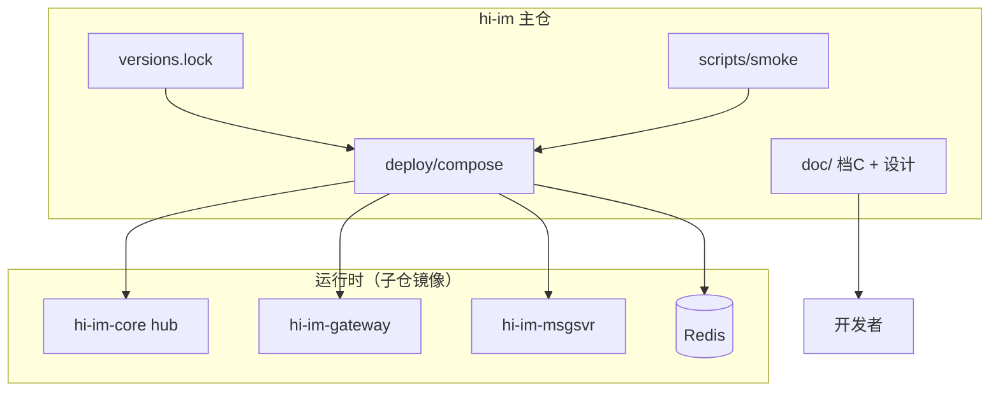

# hi-im 技术设计文档

> **组件**：hi-im（主仓 / Meta Repo）  
> **层级**：编排与文档（**不运行业务逻辑**）  
> **必嗨等价**：无单一对应物；近似 `beehive-im` 根目录的 `docker-compose.yml` + 演示脚本 + 文档入口  
> **版本**：v0.1 · 2026-07-02  
> **生态**：对应 [hi-im-档C技术方案设计.md](hi-im-档C技术方案设计.md) **M3 起**（Compose）；**M8** 扩展 K8s/Helm

---

## 1. 定位与边界

### 1.1 是什么

**hi-im** 是 hi-im 生态的 **主仓（Meta Repo）**，职责是：

| 职责 | 说明 |
|------|------|
| **文档枢纽** | 档 C 总方案、本仓设计、子仓文档索引 |
| **本地编排** | Docker Compose：按里程碑拉起 Hub + 中间件 + 各服务 |
| **集群编排** | K8s YAML / Helm（M8）：Ingress、StatefulSet Hub 分片、HPA |
| **版本矩阵** | 锁定各子仓 **镜像 tag / git tag**，保证可复现联调 |
| **集成冒烟** | 跨仓库端到端脚本（M3 unicast → M6 群聊 → M9 Kafka） |
| **发布叙事** | CHANGELOG、Demo 入口说明、面试/README 一句话 |

原设计稿中的 **`hi-im-deploy`** 已合并为本仓库名 **`hi-im`**；不再单独维护 deploy 仓。

### 1.2 不是什么

| 不是 | 说明 |
|------|------|
| **业务服务** | 无 gateway / msgsvr 等业务代码；无 Gin 路由 |
| **L2 库** | 不含 hi-im-api、hi-im-hubclient 源码 |
| **Hub 实现** | C++ Hub 在 **hi-im-core**；本仓只引用其镜像 |
| **各服务 Dockerfile 的唯一归属** | **每个 L3/L1 子仓自带 Dockerfile**；本仓只 **引用镜像** 与 **组合编排** |
| **对外 hi-im-sdk-go** | 未来 L4；本档 C 不做 |

### 1.3 与子仓库的关系

```text
┌─────────────────────────────────────────────────────────────┐
│ hi-im（本仓库）                                               │
│   doc/ · deploy/compose · deploy/k8s · versions.lock        │
│   scripts/smoke · Makefile                                   │
└───────────────┬─────────────────────────────────────────────┘
                │ 引用镜像 / 文档链接 / 冒烟拉 git tag
    ┌───────────┼───────────┬──────────────┬────────────────┐
    ▼           ▼           ▼              ▼                ▼
hi-im-core  hi-im-api  hi-im-hubclient  hi-im-gateway  …（8 个 L3）
  构建 hub     go module    go module      自带 Dockerfile
  镜像         不部署        不部署          镜像 tag 由本仓锁定
```

**原则**（档 C §4.4）：

- **11 个 Git 仓库 ≠ 11 个 Pod**；本仓 **不增加** 运行时进程，只编排已有镜像。
- Go 服务镜像内已编入 **hi-im-api + hi-im-hubclient**；Compose/K8s 只配环境变量与依赖顺序。

---

## 2. 在生态中的位置



| 里程碑 | 本仓交付物 |
|--------|------------|
| **M3** | 最小 Compose + hubclient 测试桩 + unicast 冒烟 |
| **M4～M5** | Compose 叠加 seqsvr / usrsvr / gateway |
| **M6** | Compose profile `demo`：双窗口群聊 |
| **M7** | 叠加 chatroom / tasker |
| **M8** | K8s/Helm：2 shard Hub + Ingress + Prometheus |
| **M9** | Compose/K8s 叠加 Kafka + roomfanout |

各子仓 **单元/组件测试** 在各自仓库 CI；**跨进程验收** 在本仓 smoke。

---

## 3. 必嗨对照

| 必嗨（beehive-im 单仓） | hi-im 主仓 |
|-------------------------|------------|
| 根目录 `docker-compose.yml` 全家桶 | 分阶段 Compose profile + 子仓镜像 |
| `scripts/run-in-linux.sh` 9 进程同容器 | 每服务独立容器（K8s 友好） |
| 文档散落 `doc/` | **档 C canonical** 在本仓；子仓自有细设计 |
| 无版本锁 | **`versions.lock`** 锁 10 子仓 tag |
| `tools/rtmq-bench` | M3 起：`scripts/smoke` + hubclient 桩；压测仍在 **hi-im-core** |

---

## 4. 仓库目录结构（规划）

```text
hi-im/
├── LICENSE
├── NOTICE
├── README.md                      # 生态入口 + 10 子仓链接
├── CHANGELOG.md                   # 编排包/冒烟包发版记录
├── Makefile                       # make m3-smoke / make up / make k8s-apply
├── doc/
│   ├── README.md
│   ├── hi-im-档C技术方案设计.md    # 生态总方案（canonical）
│   ├── 技术设计文档.md             # 本文档
│   └── M1-实施清单.md              # 生态 M3 任务（本仓首期）
├── versions/
│   └── lock.yaml                  # 各子仓 git tag → 镜像 digest/tag
├── deploy/
│   ├── compose/
│   │   ├── docker-compose.yml     # 基础：networks + 公共 env
│   │   ├── docker-compose.m3.yml  # M3：hub + redis + smoke-stub
│   │   ├── docker-compose.m6.yml  # M6：+ gateway usrsvr msgsvr seqsvr
│   │   ├── docker-compose.m9.yml  # M9：+ kafka + roomfanout
│   │   └── .env.example
│   ├── k8s/                       # M8
│   │   ├── base/
│   │   ├── overlays/
│   │   │   ├── dev/
│   │   │   └── prod/
│   │   └── README.md
│   └── helm/                      # 可选，与 k8s 二选一或并存
│       └── hi-im/
├── scripts/
│   ├── smoke/
│   │   ├── m3-unicast.sh
│   │   ├── m6-group-chat.sh
│   │   └── common.sh
│   └── demo-proxy.py              # 静态页代理（可选，M5+）
├── examples/
│   └── hubclient-stub/            # M3：最小 hubclient 进程（或引用 hubclient/examples）
└── .github/
    └── workflows/
        └── smoke-m3.yml           # nightly / tag 触发跨仓冒烟
```

**刻意不放**：

- 各 L3 服务源码（在各自 Git 仓库）
- hi-im-core 构建逻辑（仅 `image: ghcr.io/.../hi-im-hub:${TAG}` 引用）

---

## 5. 版本矩阵（versions.lock）

### 5.1 目的

多仓独立发版时，开发者 clone 主仓后应能 **一键复现** 某次冒烟通过的组件组合。

### 5.2 格式（示例）

```yaml
# versions/lock.yaml
schema: 1
bundle: m3-smoke
updated: "2026-07-02"

images:
  hi-im-hub:
    repo: ghcr.io/sunchao1/hi-im-core
    tag: v0.1.0
  hi-im-gateway:
    repo: ghcr.io/sunchao1/hi-im-gateway
    tag: v0.0.0        # 未发布时用 build 占位

modules:
  hi-im-api: v0.1.0
  hi-im-hubclient: v0.1.0

git:
  hi-im-core: v0.1.0
  hi-im-api: v0.1.0
  hi-im-hubclient: v0.1.0
  # …
```

### 5.3 使用方式

| 场景 | 做法 |
|------|------|
| 本地 M3 | `make m3-up` 读取 lock，拉取/构建 hub 镜像 |
| CI | checkout 主仓 + `docker compose pull` + smoke |
| 发版 | bump lock 中 tag → CHANGELOG → git tag `bundle-m3-2026.07` |

**规则**：

- lock 变更与 **冒烟通过** 绑定；未过 smoke 不得 bump。
- L2 **go module** 版本记录在 `modules`；L1/L3 记录在 `images`。

---

## 6. Docker Compose 设计

### 6.1 Profile 分层

| Profile | 服务 | 生态里程碑 |
|---------|------|------------|
| `infra` | redis（M3 起）；mysql/mongo（M4+ 按需） | M3+ |
| `hub` | hi-im-hub（来自 hi-im-core 镜像） | M3+ |
| `smoke` | hubclient-stub、smoke runner | M3 |
| `biz` | seqsvr, usrsvr, msgsvr, gateway | M4～M6 |
| `room` | chatroom, tasker | M7 |
| `kafka` | kafka, zookeeper, roomfanout | M9 |
| `demo` | demo-web 静态页 | M5+ |

组合示例：

```bash
# M3 最小（档 C §11.3）
docker compose -f deploy/compose/docker-compose.yml \
               -f deploy/compose/docker-compose.m3.yml \
               --profile infra --profile hub --profile smoke up -d

# M6 群聊 Demo
docker compose ... -f docker-compose.m6.yml \
               --profile infra --profile hub --profile biz --profile demo up -d
```

### 6.2 M3 最小栈（档 C 强制范围）

**必须包含**：

| 服务 | 来源 | 说明 |
|------|------|------|
| **hi-im-hub** | hi-im-core 镜像 | FORWARD 28888 / BACKEND 28889 |
| **redis** | 官方镜像 | M3 仅 infra；群聊键 M6 才用 |
| **smoke-stub** | 本仓 `examples/hubclient-stub` | 2 个 NID：FORWARD consumer + BACKEND producer |
| **smoke-runner** | 本仓脚本容器 | 跑 `m3-unicast.sh`，失败 exit 1 |

**M3 不得包含**（验收边界，档 C §11.5）：

- hi-im-gateway / 浏览器 WS
- hi-im-msgsvr（群聊第一段 fan-out）
- 群聊 / 双窗口 Demo

### 6.3 M3 冒烟逻辑

对齐 [hi-im-hubclient 设计](https://github.com/sunchao1/hi-im-hubclient/blob/main/doc/技术设计文档.md) 与 beehive `rtmq-bench -mode unicast`：

```text
1. 等待 hub /readyz
2. 启动 Consumer：NID=40001，连 FORWARD，SUB benchCmd
3. 启动 Producer：NID=50001，连 BACKEND
4. Producer AsyncSend(benchCmd, destNid=40001, imFrame)
5. 断言 Consumer 收到 ≥1 帧；超时 30s → FAIL
```

### 6.4 M6 栈扩展

在 M3 基础上增加（档 C §4.4 最小群聊）：

```text
hi-im-hub + Redis + hi-im-seqsvr + hi-im-usrsvr + hi-im-msgsvr + hi-im-gateway
```

| 服务 | 平面 / 端口 | 关键 env |
|------|-------------|----------|
| gateway ×2 | FORWARD | `HIIM_NID=20001/20002`，`HIIM_FORWARD_ADDR=hub:28888` |
| msgsvr | BACKEND | `HIIM_BACKEND_ADDR=hub:28889`，SUB `GROUP-CHAT` |
| usrsvr | BACKEND + HTTP | gRPC → seqsvr |
| seqsvr | gRPC | Thrift 替代 |

**M6 验收脚本** `m6-group-chat.sh`：双 gateway 容器 + Redis 建群 + 断言 B 收到 GROUP-CHAT（细节在 M6 清单扩展）。

### 6.5 兼容期双跑（可选）

档 C §8.3：Compose 内 **`frwder`（beehive）+ `hi-im-hub`** 不同端口；`smoke` 可增 profile `legacy` 对比 unicast。仅本地调试，**不算 hi-im 里程碑完成**。

### 6.6 与子仓 Compose 的关系

| 仓库 | 自有 Compose | 与本仓关系 |
|------|--------------|------------|
| **hi-im-core** | `docker-compose.yml`（Hub 单测/压测） | 本仓 **引用 hub 镜像**；不在此重复 build |
| **hi-im-gateway** 等 | 各仓可选 dev compose | 本仓为 **全栈联调** 权威入口 |

开发者日常：

- 只改 core → 在 **hi-im-core** 跑 bench
- 跨服务联调 → 在 **hi-im** 主仓跑 profile

---

## 7. Kubernetes / Helm（M8）

### 7.1 目标

档 C §10：

```text
Ingress (wss://im.example.com)
  └── hi-im-gateway Deployment (HPA)
        └── HIIM_FORWARD → hi-im-hub-{shard}

hi-im-hub-0 StatefulSet  (固定 NID 范围)
hi-im-hub-1 StatefulSet

hi-im-msgsvr / chatroom / usrsvr Deployment
hi-im-seqsvr Deployment
```

### 7.2 目录约定

| 路径 | 内容 |
|------|------|
| `deploy/k8s/base/hub/` | Hub StatefulSet、Service headless、ConfigMap auth |
| `deploy/k8s/base/gateway/` | Deployment、Service、HPA |
| `deploy/k8s/base/ingress/` | Ingress 固定 wss URL |
| `deploy/k8s/overlays/dev/` | 单 shard、低副本 |
| `deploy/k8s/overlays/prod/` | 2 shard、Prometheus ServiceMonitor |

### 7.3 Hub 分片与环境变量

| 组件 | 配置 |
|------|------|
| **gateway** | `HIIM_SHARD_ID`、`HIIM_NID` 落在 shard NID 范围 |
| **msgsvr** | 可配 multi-backend 或单 BACKEND Service |
| **Hub** | StatefulSet `hub-0`、`hub-1`；每 Pod 固定 NID 段 |

### 7.4 扩缩容约束（档 C §10）

| 组件 | 策略 |
|------|------|
| gateway | HPA on CPU / 自定义 conn metrics |
| hi-im-hub | **按 shard 增删**，禁止 blind replicas |
| msgsvr（SUB=single） | 垂直扩或 Kafka 分片 |
| roomfanout | replicas ≈ Kafka partitions |

Helm 可选：Chart `hi-im` 打包 base + values.yaml（`shardCount`、`imageTags` 读 versions.lock）。

---

## 8. Kafka 编排（M9）

| 项 | 本仓职责 |
|----|----------|
| Topic | `im.room`、`im.group` — Compose 内 Redpanda/Kafka 服务定义 |
| roomfanout | Deployment 引用 hi-im-roomfanout 镜像；`KAFKA_BROKERS`、partition 数 |
| 冒烟 | `m9-kafka-load.sh`：峰值对比表（档 C §11 M9 验收） |

热路径低峰仍 chatroom 直发 Hub；Kafka 仅削峰旁路。

---

## 9. 集成冒烟与 CI

### 9.1 脚本规范

```text
scripts/smoke/common.sh     —  wait_hub, wait_redis, assert_exit
scripts/smoke/m3-unicast.sh —  M3 验收
scripts/smoke/m6-group-chat.sh
scripts/smoke/m9-kafka-peak.sh
```

约定：

- 全部 **`set -euo pipefail`**
- 失败打印最近 200 行 `docker compose logs`
- 退出码 0/1 供 CI 使用

### 9.2 GitHub Actions（规划）

```yaml
# .github/workflows/smoke-m3.yml
on:
  push:
    paths: [deploy/**, versions/**, scripts/smoke/**]
  schedule: cron weekly

jobs:
  m3-smoke:
    runs-on: ubuntu-latest
    steps:
      - uses: actions/checkout@v4
      - run: make m3-smoke    # compose up + m3-unicast.sh
```

**不替代**子仓 CI；仅 **编排层回归**。

### 9.3 Makefile 目标（规划）

| 目标 | 说明 |
|------|------|
| `make m3-up` | 启动 M3 profile |
| `make m3-smoke` | up + smoke + down |
| `make m6-demo` | M6 全栈 + 打开 demo URL 说明 |
| `make versions-validate` | 校验 lock.yaml schema |
| `make k8s-apply-dev` | kubectl apply -k overlays/dev |

---

## 10. 环境变量约定（全栈）

主仓 Compose 统一 **前缀 `HIIM_`**（与档 C §7.3、hi-im-hubclient 一致）：

| 变量 | 使用者 | 说明 |
|------|--------|------|
| `HIIM_FORWARD_ADDR` | gateway | `hub:28888` |
| `HIIM_BACKEND_ADDR` | msgsvr / chatroom / usrsvr / roomfanout | `hub:28889` |
| `HIIM_NID` | 所有 hubclient 进程 | 全局唯一 |
| `HIIM_SHARD_ID` | gateway / hub | M8 分片 |
| `HIIM_AUTH_USER` / `HIIM_AUTH_PASS` | hub + 各 client | 与 hub 启动参数一致 |
| `HIIM_REDIS_ADDR` | L3 业务 | `redis:6379` |
| `HIIM_SEQSVR_ADDR` | usrsvr | gRPC |
| `HIIM_SUB_CMDS` | hubclient | 逗号分隔 hex cmd |

`.env.example` 放在 `deploy/compose/`，**禁止**提交真实密码。

---

## 11. 文档枢纽

### 11.1 文档分层

| 层级 | 位置 | 内容 |
|------|------|------|
| **生态总览** | 本仓 `doc/hi-im-档C技术方案设计.md` | 架构、11 仓、M1～M9 |
| **主仓编排** | 本仓 `doc/技术设计文档.md` | Compose/K8s/版本/冒烟 |
| **组件细设计** | 各子仓 `doc/` | core / api / hubclient / gateway … |

### 11.2 索引维护

`doc/README.md` 维护：

- 本仓文档阅读顺序
- 10 子仓 doc 链接
- 里程碑 ↔ 冒烟脚本对照表

beehive-im 中档 C 副本保留 **「已迁至 hi-im 主仓」** 提示，避免双源漂移。

---

## 12. 里程碑与验收（本仓视角）

> 生态 M1～M9 全文见 [档 C §11](hi-im-档C技术方案设计.md)。下表仅 **本仓交付**。

| 生态阶段 | 本仓交付 | 验收（可执行） | 不能验收 |
|----------|----------|----------------|----------|
| **M3** | M3 compose + stub + m3-unicast | Hub publish/unicast 冒烟 PASS | 群聊、WS |
| **M4** | compose 加 seqsvr/usrsvr | HTTP 注册脚本 | 群聊 |
| **M5** | compose 加 gateway + demo profile | WS 健康检查脚本 | 群聊 fan-out |
| **M6** | m6 compose + m6-group-chat.sh | 双窗口群聊 PASS | Kafka 削峰 |
| **M7** | + chatroom/tasker | 进房弹幕脚本 | — |
| **M8** | k8s 2 shard + ingress | 2 shard 压测 Job | — |
| **M9** | kafka compose + m9 脚本 | 峰值对比数据 | — |

### 12.1 M3 / M5 / M6 边界（防混淆）

| 里程碑 | 本仓 smoke 测什么 | 不测什么 |
|--------|-------------------|----------|
| **M3** | hub + hubclient unicast | 浏览器、群聊 |
| **M5** | gateway WS 握手 + 注册 HTTP | GROUP-CHAT fan-out |
| **M6** | 端到端群聊 | 聊天室 Kafka |

---

## 13. 发版与 CHANGELOG

| 类型 | tag 示例 | 说明 |
|------|----------|------|
| **编排包** | `bundle-m3-2026.07.01` | lock + compose + smoke 通过 |
| **文档** | 随主仓 `main` | 档 C 修订 |

`CHANGELOG.md` 记录：

- bump 了哪些子仓 tag
- 新增哪些 compose profile / smoke
- 已知限制（如 M3 无 WS）

---

## 14. 风险与决策

| ID | 决策 | 理由 |
|----|------|------|
| D1 | 主仓命名 **hi-im** 而非 hi-im-deploy | 生态统一品牌；README 即入口 |
| D2 | Dockerfile 留在各子仓 | 服务团队独立发版；主仓不膨胀 |
| D3 | M3 **不含** gateway/msgsvr | 档 C §11.1 群聊依赖链 |
| D4 | versions.lock 为复现权威 | 多仓 semver 易漂移 |
| D5 | smoke 脚本在主仓 | 跨进程验收天然归属编排层 |
| D6 | core 压测仍在 hi-im-core | 单组件性能不在主仓重复 |

| 风险 | 缓解 |
|------|------|
| 子仓 tag 未发布镜像 | lock 允许 `build: context: ../hi-im-core` dev override |
| Compose 与子仓 dev compose 重复 | 文档标明「全栈用主仓、单组件用子仓」 |
| M8 分片配置复杂 | M3/M6 先单 shard；M8 独立 overlay |

---

## 15. 参考

| 文档 / 代码 | 路径 |
|-------------|------|
| 档 C 总方案 | [hi-im-档C技术方案设计.md](hi-im-档C技术方案设计.md) |
| hi-im-core Hub | [hi-im-core/doc](https://github.com/sunchao1/hi-im-core/tree/main/doc) |
| hi-im-hubclient | [hi-im-hubclient/doc](https://github.com/sunchao1/hi-im-hubclient/tree/main/doc) |
| hi-im-api | [hi-im-api/doc](https://github.com/sunchao1/hi-im-api/tree/main/doc) |
| 必嗨 compose | `beehive-im/docker-compose.yml` |
| core 单仓 compose | `hi-im-core/docker-compose.yml` |
| M3 任务清单 | [M1-实施清单.md](M1-实施清单.md) |

---

*文档版本：2026-07-02 · v0.1-draft*
