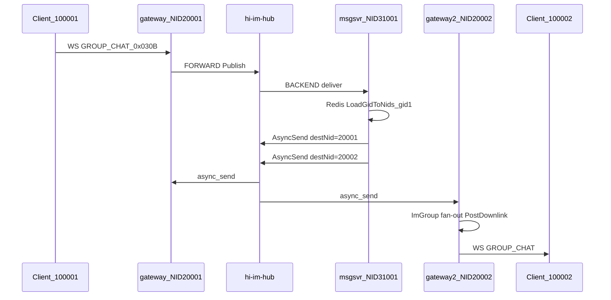

# 跨 Gateway 群聊丢消息修复计划

## 问题确认


| 消息                      | 100001 发送 (gw=1, :28080) | 100002 接收 (gw=2, :28081) |
| ----------------------- | ------------------------ | ------------------------ |
| `我是100001` / `我是100002` | 成功                       | 成功                       |
| `100001+1` ~ `+3`, `+5` | 成功（含本地回显）                | **丢失**                   |
| `100001+4`              | 成功                       | **唯一收到**                 |


发送方窗口里每条消息出现两行（`[uid 100001]` 本地回显 + `[uid undefined]` 服务端回显）是 **两个独立现象**：前者是 `[demo/web/group-app.js](demo/web/group-app.js)` 的 `sendChat` 本地回显；后者说明服务端下行帧里 `uid` 字段缺失，导致 `Number(chat.uid) === state.uid` 跳过逻辑失效（见 `[group-app.js:220-224](demo/web/group-app.js)`）。

**注意**：截图 URL 为 `8088`，文档 `[doc/常见错误集.md](doc/常见错误集.md)` §1 指出 8088 可能是 beehive 旧 demo。排查前需确认实际使用的是 `deploy/compose/.env` 中的 `HIIM_DEMO_WEB_PORT`（常见 8089）。

---

## 消息链路（无 gateway 直连）




关键代码路径：

- msgsvr 第一段 fan-out：`[hi-im-msgsvr/internal/handler/group_chat.go](../../hi-im-msgsvr/internal/handler/group_chat.go)` L119-131
- hub nid 路由：`[hi-im-core/src/hub/bridge.cpp](../../hi-im-core/src/hub/bridge.cpp)` L52-67
- hub 队列丢弃：`[hi-im-core/src/hub/distributor.cpp](../../hi-im-core/src/hub/distributor.cpp)` L78-80
- gateway 第二段 fan-out：`[hi-im-gateway/internal/hub/downlink/group_chat.go](../../hi-im-gateway/internal/hub/downlink/group_chat.go)` L135-152
- 异步下行队列（已修但仍可丢）：`[hi-im-gateway/internal/ws/outbound.go](../../hi-im-gateway/internal/ws/outbound.go)` L29-34
- **潜在新瓶颈**：`EnqueueWrite` 对 `writeC`(512) **阻塞发送**，可能卡住 `downlinkLoop`，进而填满 `downlinkQ`(4096) 导致 `PostDownlink` 静默丢弃 — `[hi-im-gateway/internal/conn/conn.go](../../hi-im-gateway/internal/conn/conn.go)` L103-110

---

## 阶段 1：定位断点（必须先做）

按 `[doc/常见错误集.md](doc/常见错误集.md)` §5 全链路 grep，对每条 `100001+N` 逐段核对：


| 阶段  | 组件        | 期望日志                                                      |
| --- | --------- | --------------------------------------------------------- |
| 1   | msgsvr    | `group-chat: fan-out dest ok destNid=20002 text=100001+N` |
| 2   | hub       | 失败时 `[bridge] backend async_send nid=20002 err=...`       |
| 3   | gateway-2 | `hub tcp recv text=100001+N`                              |
| 4   | gateway-2 | `group-chat downlink: recv text=100001+N`                 |
| 5   | gateway-2 | `downlink queued` → `ws write ok`                         |


**自动化复现**（排除浏览器因素）：

```bash
# 1. 恢复干净栈
make m6-heal

# 2. 终端 burst 测试（7 条双向）
cd examples/smoke-group
HIIM_USRSVR_URL=http://127.0.0.1:8089 \
HIIM_GATEWAY_A_WS=ws://127.0.0.1:28080/ws \
HIIM_GATEWAY_B_WS=ws://127.0.0.1:28081/ws \
go run . -burst

# 3. 若 burst 也失败，逐条 grep
TEXT='100001+1'
docker logs hi-im-msgsvr-1 2>&1 | grep "$TEXT"
docker logs hi-im-gateway-2-1 2>&1 | grep "$TEXT"
docker logs hi-im-hub-1 2>&1 | grep -E 'bridge|distributor|queue full'
```

**断点解读**：

- 阶段 1 缺失 → uplink / hub SUB 到 msgsvr 问题 → `make m6-heal`
- 阶段 1 有、阶段 3 无 → **hub → gateway-2 TCP 丢失**（文档已记录的实测断点）
- 阶段 3 有、阶段 5 无 → gateway 下行队列 / WS 写失败
- burst 通过但浏览器失败 → demo 端口/缓存/操作问题

将结论写入 `[doc/debug_lose_message_process_detail.log](doc/debug_lose_message_process_detail.log)` STEP-1~3。

---

## 阶段 2：按断点修复

### 场景 A：hub → gateway 段丢失（最可能）

**根因**：hub `Distributor` / `Publish` 队列满时静默丢弃（`[distributor.cpp:78-80](../../hi-im-core/src/hub/distributor.cpp)`），或 gateway-2 FORWARD 连接断开后 `AsyncSend` 返回 `nid not connected`。

**修复**（`[hi-im-core](../../hi-im-core)`）：

1. distributor 丢弃时打印 **dest_nid + seq + cmd**（从 IM header 解析），便于 grep
2. `AsyncSend` 失败时 hub bridge 已有日志，确认 gateway 重连后 nid_map 刷新正常
3. 评估是否需在 compose 增大 `--queue-capacity`（默认 262144，通常够用；若 burst 仍满则排查 reactor 消费慢）

**运行态**：`make m6-heal` 会 ordered restart hub → backends → gateways 并重建 bridge IM-header 路由（见 `[scripts/m6-heal.sh](scripts/m6-heal.sh)`）。

### 场景 B：gateway-2 下行丢失

**根因**：虽已改为 `PostDownlink` 异步（`[doc/常见错误集.md](doc/常见错误集.md)` §5 已修），但 `downlinkLoop → Send → EnqueueWrite` 在 `writeC` 满时**阻塞**，导致 `downlinkQ` 积压后 `PostDownlink` 非阻塞丢弃。

**修复**（`[hi-im-gateway](../../hi-im-gateway)`）：

1. `**EnqueueWrite` 改为非阻塞**：`writeC` 满时 log warn + return false（与 `PostDownlink` 一致），避免单连接慢消费拖死全局 `downlinkLoop`
2. `GroupChatHandler` 在 `Send` 返回 false 时打 warn（含 gid/sid/seq/text）
3. 可选：增大 `writeC` buffer（512 → 2048）作为缓冲，但不替代非阻塞改造

### 场景 C：msgsvr 部分 fan-out 失败

**根因**：`[group_chat.go:119-127](../../hi-im-msgsvr/internal/handler/group_chat.go)` 任一 `destNid` 失败即 `return`，可能造成**部分 gateway 收到、部分丢失**。

**修复**：改为 best-effort — 记录失败 destNid 但继续 fan-out 其余 NID；全部失败才 `sendFailed`。

### 场景 D：仅浏览器失败（burst 通过）

1. 确认使用正确端口（`.env` 的 `HIIM_DEMO_WEB_PORT`，非 beehive 8088）
2. 两窗口 Cmd+Shift+R 硬刷新
3. gateway 重启后两窗口重新 ONLINE + 建群/加群
4. 以**接收方窗口**日志为准；发送方灰色斜体仅为本地回显

---

## 阶段 3：修复 `[uid undefined]`（次要但应一并处理）

1. 在 gateway `GroupChatHandler` 下行日志中确认 `req.GetUid()` 是否为 0
2. 若 body 中 uid 正常但前端 undefined → 检查 demo 是否加载旧版 `pb.js`
3. 前端防御性改进（`[demo/web/group-app.js](demo/web/group-app.js)`）：收到 `GROUP_CHAT` 且 `chat.uid` 缺失时，用 header sid 映射或跳过重复回显，避免 `[uid undefined]` 误导排查

---

## 阶段 4：回归验证

1. `make m6-heal && go run examples/smoke-group -burst` — 7 条双向全收
2. 浏览器手动复现：gw=1 连发 10 条，gw=2 全收
3. 更新 `[doc/debug_lose_message_process_detail.log](doc/debug_lose_message_process_detail.log)` STEP-7 结论
4. 若 hub/gateway 有代码改动，确保 compose rebuild：`make m6-down && make m6-demo`

---

## 涉及仓库


| 仓库                                     | 可能改动                                       |
| -------------------------------------- | ------------------------------------------ |
| `[hi-im](.)`                           | 调试日志、burst 验证、demo 前端防御                    |
| `[hi-im-gateway](../../hi-im-gateway)` | `EnqueueWrite` 非阻塞、`GroupChatHandler` 错误日志 |
| `[hi-im-core](../../hi-im-core)`       | distributor 丢弃日志增强                         |
| `[hi-im-msgsvr](../../hi-im-msgsvr)`   | fan-out best-effort                        |


---

## 预期结论

基于现有文档与代码分析，**最可能的根因**是 hub → gateway-2 段间歇性丢包，或 gateway `downlinkLoop` 被 `writeC` 阻塞导致 `PostDownlink` 丢弃。阶段 1 的 burst + grep 将在 15 分钟内确认具体断点，再实施对应修复。